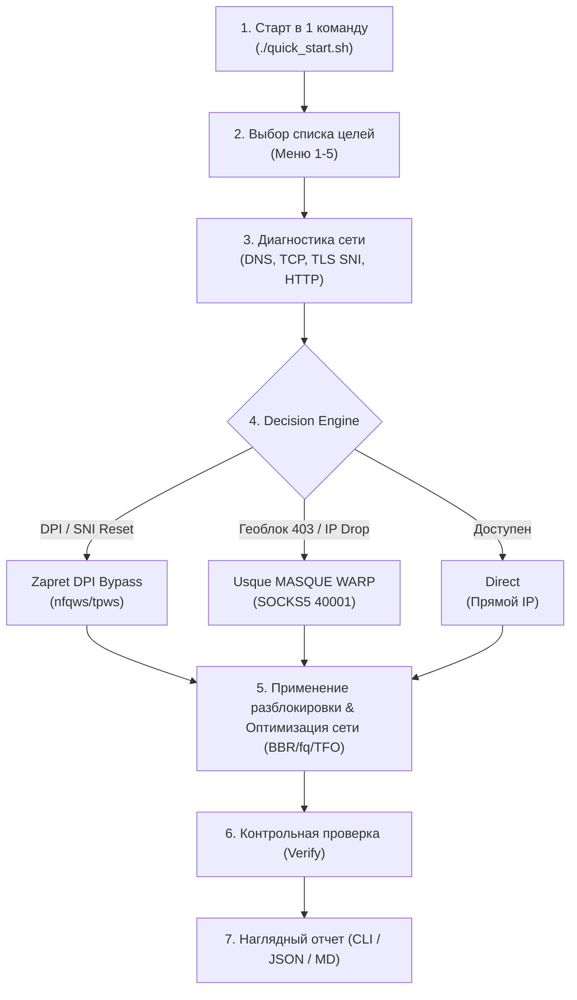

# 🚀 RU-UNBLOCK-TOOLKIT

[🇷🇺 Читать на русском](README.md) | [🇬🇧 Read in English](README_EN.md)

---

**Универсальный автоматизированный комплекс диагностики, разблокировки сервисов и оптимизации сетевого стека Linux.**

Комплекс объединяет проверенные решения для восстановления стабильного доступа к сетевым ресурсам:
* ⚡ **Сетевая оптимизация ядра (Kernel Tuning):** Тюнинг сетевого стека Linux (`BBR`, `fq`, `TCP Fast Open`, 16 МБ буферы сокетов, оптимизация somaxconn и защита от bufferbloat).
* 🛡️ **Гибридный комплекс обхода (Bypass Suite):**
  * **Zapret DPI Bypass (`nfqws`/`tpws`)** — обход локальных DPI-блокировок и замедления (YouTube 4K, Discord, Twitter/X, Rutracker) без снижения скорости и с сохранением прямого IP-адреса.
  * **Usque MASQUE CLI (HTTP/3 over QUIC SOCKS5)** — подключение к Cloudflare WARP через протокол MASQUE для сервисов с региональными ограничениями и геоблокировкой (ChatGPT/OpenAI, Claude/Anthropic, Spotify, Netflix, Canva, Autodesk).
  * **Cloudflare WARP (WireGuard `wg-quick`)** — прямой WireGuard туннель с раздельной маршрутизацией (fwmark) и MSS-клампингом.
  * **Альтернативные DPI-инструменты:** Встроенная поддержка ByeDPI (`ciadpi`) и `SpoofDPI`.

---

## 🌟 Ключевые возможности

1. **Запуск в одну команду:** Полный цикл проверки, настройки и разблокировки запускается одной командой: `./unblock.sh` или `python3 unblock.py`.
2. **Многоязычный интерфейс (RU / EN):** Поддержка русского и английского языков с удобным выбором цифрами `1-5`.
3. **Гибкий выбор списков доменов:**
   * Встроенный курируемый список популярных сервисов.
   * Актуальные списки заблокированных ресурсов с GitHub (AntiZapret, AntiFilter).
   * Возможность указать собственный файл или проверить отдельный домен.
4. **Глубокая диагностика доступности (Smart Diagnostic):**
   * Точное определение причины недоступности: **DPI-сброс (TCP RST / TLS SNI reset)**, **Геоблокировка (HTTP 403/451)**, **IP Blackhole (таймаут)** или **DNS-сбои**.
5. **Умный селектор инструментов (Decision Engine):**
   * Направляет DPI-блокировки в **Zapret** (минимальная задержка, прямой IP).
   * Направляет геоблокировки и санкционные ресурсы в **Usque MASQUE**.
   * Оставляет нетронутыми доступные сервисы (Direct IP).
6. **Автоматическая разблокировка и Smart Routing:**
   * Автоустановка и управление системными службами.
   * Экспорт готовых правил маршрутизации (Smart Routing) для Xray / Sing-box / PAC.
7. **Контрольная проверка (Verification):**
   * Повторное тестирование всех сервисов через активированные каналы обхода.
8. **Наглядные отчеты:**
   * Форматированная таблица в терминале с пингом и статусами «До» $\rightarrow$ «После».
   * Автоэкспорт отчетов в `unblock_report.json` и `unblock_report.md`.

---

## 📋 Архитектура работы



---

## 🚀 Быстрый запуск (В одну команду)

### ⚡ Мгновенный запуск одной строкой (Auto-Install & Run):

Скрипт сам установит зависимости, склонирует репозиторий в `/opt/ru-unblock-toolkit` и запустит интерактивную диагностику:

```bash
bash -c "$(curl -fsSL https://raw.githubusercontent.com/Kavis1/RU-UNBLOCK-TOOLKIT/main/quick_start.sh)"
```

Или через `wget`:
```bash
bash -c "$(wget -qO- https://raw.githubusercontent.com/Kavis1/RU-UNBLOCK-TOOLKIT/main/quick_start.sh)"
```

---

### 📦 Ручная установка через Git:

```bash
git clone https://github.com/Kavis1/RU-UNBLOCK-TOOLKIT.git /opt/ru-unblock-toolkit
cd /opt/ru-unblock-toolkit
sudo ./unblock.sh
```

### 💻 Кроссплатформенный запуск через Python:

```bash
git clone https://github.com/Kavis1/RU-UNBLOCK-TOOLKIT.git
cd ru-unblock-toolkit
pip install -r requirements.txt
python3 unblock.py
```

---

## ⚙️ Флаги и аргументы командной строки

| Флаг | Описание |
|---|---|
| `--lang {ru,en}` | Язык интерфейса (русский или английский) |
| `--list popular` | Использовать встроенный список популярных сервисов |
| `--list github` | Синхронизировать и использовать расширенный список с GitHub |
| `--file <path>` | Использовать собственный текстовый файл со списком доменов |
| `--domain <domain>` | Проверить и разблокировать один конкретный домен |
| `--check-only` | Только провести диагностику без изменения конфигурации и сервисов |
| `--dry-run` | Тестовый прогон без внесения изменений в систему |
| `--no-tuning` | Пропустить этап оптимизации сетевого стека ядра (sysctl) |
| `--all-tools` | Подтянуть и активировать все альтернативные инструменты (ByeDPI, SpoofDPI) |

### Примеры запуска:

```bash
# Быстрая проверка конкретного домена
python3 unblock.py --domain chatgpt.com

# Запуск на английском языке
python3 unblock.py --lang en

# Только диагностика популярных сайтов без применения изменений
python3 unblock.py --list popular --check-only

# Полная разблокировка с синхронизацией блок-листов с GitHub
sudo python3 unblock.py --list github
```

---

## 📁 Структура проекта

```
ru-unblock-toolkit/
├── README.md                      # Документация на русском
├── README_EN.md                   # English documentation
├── LICENSE                        # MIT License
├── config.yaml                    # Файл конфигурации и портов
├── requirements.txt               # Python зависимости
├── quick_start.sh                 # Скрипт мгновенной автоустановки и запуска
├── unblock.sh                     # Баш-лаунчер в одну команду
├── unblock.py                     # Главный многоязычный CLI оркестратор
├── data/
│   ├── popular_ru_blocked.txt     # Встроенный список популярных блокировок
│   └── blocklist_sources.json     # Источники списков на GitHub
├── core/
│   ├── __init__.py
│   ├── network_tuner.py           # Оптимизация ядра Linux (sysctl BBR)
│   ├── checker.py                 # Диагностика и детекция блокировок
│   ├── tool_manager.py            # Управление сервисами (Usque, Zapret, WARP)
│   ├── unblocker.py               # Оркестрация разблокировки и Smart Routing
│   ├── verifier.py                # Контрольная проверка после применения
│   └── reporter.py                # Форматирование отчетов (CLI/JSON/MD)
├── tools/
│   ├── usque/                     # Конфигурации и сервисы Usque MASQUE
│   ├── zapret/                    # Пресеты десинхронизации Zapret nfqws
│   ├── warp/                      # Скрипты WireGuard WARP с fwmark
│   └── alternatives/              # ByeDPI и SpoofDPI
└── scripts/
    ├── tune_kernel.sh             # Автономный скрипт тюнинга ядра
    ├── install_usque.sh           # Автономный установщик Usque MASQUE
    ├── install_zapret.sh          # Автономный установщик Zapret
    └── fetch_blocklists.py        # Синхронизация списков с GitHub
```

---

## 📊 Пример отчета

```text
========================================================================
🚀 RU-UNBLOCK-TOOLKIT | Авторазблокировка и оптимизация сети
   Kernel BBR/fq/TFO | Usque MASQUE + Zapret DPI Bypass
========================================================================

Домен                        | Исходный статус    | Инструмент       | Итог             | Пинг      
--------------------------------------------------------------------------------------------------
chatgpt.com                  | GEO_BLOCKED        | USQUE            | 🟢 РАЗБЛОКИРОВАН  | 42 ms     
discord.com                  | DPI_BLOCKED        | ZAPRET           | 🟢 РАЗБЛОКИРОВАН  | 18 ms     
instagram.com                | DPI_BLOCKED        | ZAPRET           | 🟢 РАЗБЛОКИРОВАН  | 24 ms     
spotify.com                  | GEO_BLOCKED        | USQUE            | 🟢 РАЗБЛОКИРОВАН  | 35 ms     
youtube.com                  | DPI_BLOCKED        | ZAPRET           | 🟢 РАЗБЛОКИРОВАН  | 12 ms     
yandex.ru                    | Доступен           | Direct (Прямой)  | 🟢 DIRECT         | 4 ms      
--------------------------------------------------------------------------------------------------

📊 СВОДНЫЙ ОТЧЕТ:
  • Всего проверено доменов: 6
  • Изначально доступно напрямую: 1
  • Было заблокировано / ограничено: 5
  • Успешно разблокировано: 5 из 5 (100.0%)

💾 Отчет JSON сохранен: unblock_report.json
📄 Отчет Markdown сохранен: unblock_report.md
```

---

## 🙏 Благодарности проектам (Acknowledgements)

Выражаем огромную благодарность создателям и мейнтейнерам проектов с открытым исходным кодом, на базе которых построен данный комплекс:

* **[Zapret](https://github.com/bol-van/zapret)** от [@bol-van](https://github.com/bol-van) — непревзойденный инструмент обхода DPI и десинхронизации сетевых пакетов.
* **[Usque MASQUE CLI](https://github.com/Diniboy1123/usque)** от [@Diniboy1123](https://github.com/Diniboy1123) — клиент Cloudflare WARP по современному протоколу MASQUE (HTTP/3 over QUIC).
* **[Cloudflare WARP](https://developers.cloudflare.com/warp-client/)** и **[WireGuard](https://www.wireguard.com/)** — глобальная сеть и производительный туннель.
* **[ByeDPI](https://github.com/hufrea/byedpi)** от [@hufrea](https://github.com/hufrea) — легковесный userspace прокси десинхронизации TCP.
* **[SpoofDPI](https://github.com/xvzc/SpoofDPI)** от [@xvzc](https://github.com/xvzc) — быстрый инструмент обхода DPI на Go.
* Сообществам **[AntiFilter](https://antifilter.download/)** и **[AntiZapret](https://antizapret.prostovpn.org/)** — за поддержание актуальных списков и реестров блокировок.

---

## 📜 Лицензия

Распространяется под лицензией [MIT](LICENSE).
Проект предназначен для улучшения стабильности, скорости и надежности сетевых подключений.
