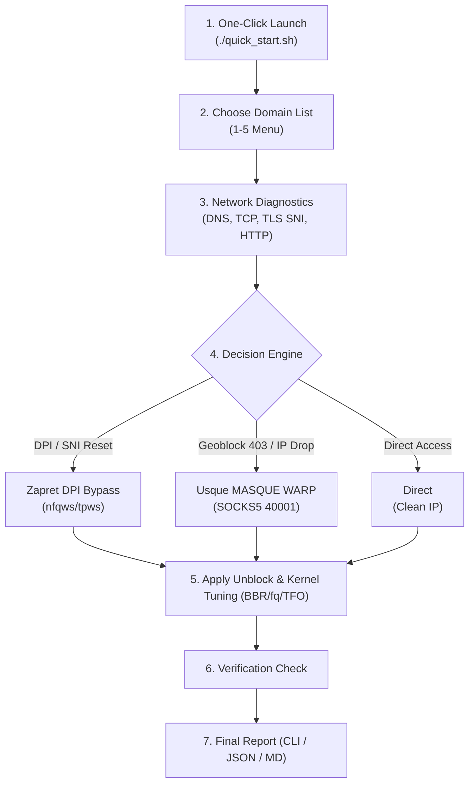

# 🚀 RU-UNBLOCK-TOOLKIT

[🇷🇺 Читать на русском](README.md) | [🇬🇧 Read in English](README_EN.md)

---

**Universal automated network diagnostic, service unblocking, and Linux kernel optimization toolkit.**

This toolkit combines battle-tested networking solutions to diagnose and restore access to restricted online services:
* ⚡ **Linux Kernel Network Optimization:** BBR congestion control, `fq` queue discipline, TCP Fast Open (0-RTT), 16MB socket buffers, somaxconn optimization, and bufferbloat mitigation.
* 🛡️ **Hybrid Bypass Suite:**
  * **Zapret DPI Bypass (`nfqws`/`tpws`)** — Bypasses deep packet inspection (DPI) and throttling (YouTube 4K, Discord, Twitter/X, Rutracker) directly at the Linux kernel level with zero latency penalty and keeping the direct IP address.
  * **Usque MASQUE CLI (HTTP/3 over QUIC SOCKS5)** — SOCKS5 proxy via Cloudflare WARP MASQUE protocol for services with regional IP restrictions (ChatGPT/OpenAI, Claude/Anthropic, Spotify, Netflix, Canva, Autodesk).
  * **Cloudflare WARP (WireGuard `wg-quick`)** — Native WireGuard tunnel with split routing (`fwmark`) and MSS clamping.
  * **Alternative DPI tools:** Built-in support for ByeDPI (`ciadpi`) and `SpoofDPI`.

---

## 🌟 Key Features

1. **One-Command Execution:** Complete diagnosis, tuning, and unblocking flow in a single command: `sudo ./unblock.sh` or `python3 unblock.py`.
2. **Multilingual Interactive CLI:** Full support for Russian and English languages with easy numbered menus (`1-5`).
3. **Flexible Target Lists:**
   * Curated built-in list of top restricted services.
   * Remote community blocklists synchronized from GitHub (AntiZapret, AntiFilter).
   * Custom domain lists or single domain input.
4. **Deep Network Diagnostics (Smart Diagnostic):**
   * Identifies exact failure reasons: **DPI Reset (TCP RST / TLS SNI reset)**, **Geoblocking (HTTP 403/451)**, **IP Blackhole (Timeout)**, or **DNS Poisoning**.
5. **Smart Tool Selector (Decision Engine):**
   * Routes DPI-filtered domains to **Zapret** (minimum latency, direct IP).
   * Routes geoblocked services to **Usque MASQUE**.
   * Leaves accessible services untouched (Direct IP).
6. **Automated Deployment & Smart Routing:**
   * Automated service setup and systemd integration.
   * Exports ready-to-use Smart Routing rules for Xray / Sing-box / PAC clients.
7. **Post-Unblock Verification & Reporting:**
   * Re-tests services after unblock activation.
   * Clear terminal summary tables and exports to `unblock_report.json` and `unblock_report.md`.

---

## 📋 Execution Flow



---

## 🚀 Quick Start (Single Command)

### ⚡ Instant 1-Line Bootstrap (Auto-Install & Run):

The script installs all dependencies, clones the repo to `/opt/ru-unblock-toolkit`, and launches the interactive menu:

```bash
bash -c "$(curl -fsSL https://raw.githubusercontent.com/Kavis1/RU-UNBLOCK-TOOLKIT/main/quick_start.sh)"
```

Or using `wget`:
```bash
bash -c "$(wget -qO- https://raw.githubusercontent.com/Kavis1/RU-UNBLOCK-TOOLKIT/main/quick_start.sh)"
```

---

### 📦 Manual Git Clone:

```bash
git clone https://github.com/Kavis1/RU-UNBLOCK-TOOLKIT.git /opt/ru-unblock-toolkit
cd /opt/ru-unblock-toolkit
sudo ./unblock.sh
```

### 💻 Cross-Platform Python Execution:

```bash
git clone https://github.com/Kavis1/RU-UNBLOCK-TOOLKIT.git
cd ru-unblock-toolkit
pip install -r requirements.txt
python3 unblock.py --lang en
```

---

## ⚙️ Command-Line Arguments

| Flag | Description |
|---|---|
| `--lang {en,ru}` | Set interface language (English or Russian) |
| `--list popular` | Use the built-in list of top restricted services |
| `--list github` | Sync and use the extended GitHub community blocklist |
| `--file <path>` | Use custom text file with domain list |
| `--domain <domain>` | Check and unblock a single specific domain |
| `--check-only` | Run diagnostics only without applying changes |
| `--dry-run` | Test run without modifying system configuration |
| `--no-tuning` | Skip Linux kernel network optimization (sysctl) |
| `--all-tools` | Pull and enable all alternative tools (ByeDPI, SpoofDPI) |

### Usage Examples:

```bash
# Quick single-domain test in English
python3 unblock.py --domain chatgpt.com --lang en

# Diagnostic-only check for popular domains
python3 unblock.py --list popular --check-only --lang en

# Full unblock with GitHub blocklists sync
sudo python3 unblock.py --list github --lang en
```

---

## 📁 Repository Structure

```
ru-unblock-toolkit/
├── README.md                      # Russian documentation
├── README_EN.md                   # English documentation
├── LICENSE                        # MIT License
├── config.yaml                    # Global configuration & ports
├── requirements.txt               # Python dependencies
├── quick_start.sh                 # 1-line auto-installer & launcher
├── unblock.sh                     # Bash entrypoint
├── unblock.py                     # Multilingual CLI orchestrator
├── data/
│   ├── popular_ru_blocked.txt     # Curated top domains list
│   └── blocklist_sources.json     # Remote GitHub sources
├── core/
│   ├── __init__.py
│   ├── network_tuner.py           # Kernel sysctl tuning (BBR/fq/TFO)
│   ├── checker.py                 # Deep network diagnostic probe
│   ├── tool_manager.py            # Lifecycle management (Usque, Zapret, WARP)
│   ├── unblocker.py               # Unblock orchestration & Smart Routing
│   ├── verifier.py                # Post-unblock verification
│   └── reporter.py                # Visual terminal & file reports
├── tools/
│   ├── usque/                     # Usque MASQUE configs & systemd units
│   ├── zapret/                    # Zapret nfqws presets
│   ├── warp/                      # WireGuard WARP fwmark scripts
│   └── alternatives/              # ByeDPI & SpoofDPI scripts
└── scripts/
    ├── tune_kernel.sh             # Standalone kernel tuning script
    ├── install_usque.sh           # Standalone Usque installer
    ├── install_zapret.sh          # Standalone Zapret installer
    └── fetch_blocklists.py        # GitHub blocklist synchronization
```

---

## 📊 Sample Output

```text
========================================================================
🚀 RU-UNBLOCK-TOOLKIT | Unblock & Network Optimization Suite
   Kernel BBR/fq/TFO | Usque MASQUE + Zapret DPI Bypass
========================================================================

Domain                       | Original Status    | Tool Applied     | Final Result     | Latency   
--------------------------------------------------------------------------------------------------
chatgpt.com                  | GEO_BLOCKED        | USQUE            | 🟢 UNBLOCKED      | 42 ms     
discord.com                  | DPI_BLOCKED        | ZAPRET           | 🟢 UNBLOCKED      | 18 ms     
instagram.com                | DPI_BLOCKED        | ZAPRET           | 🟢 UNBLOCKED      | 24 ms     
spotify.com                  | GEO_BLOCKED        | USQUE            | 🟢 UNBLOCKED      | 35 ms     
youtube.com                  | DPI_BLOCKED        | ZAPRET           | 🟢 UNBLOCKED      | 12 ms     
yandex.ru                    | Accessible         | Direct (Clean)   | 🟢 DIRECT         | 4 ms      
--------------------------------------------------------------------------------------------------

📊 SUMMARY REPORT:
  • Total domains checked: 6
  • Direct / Accessible originally: 1
  • Blocked / Restricted initially: 5
  • Successfully unblocked: 5 of 5 (100.0%)

💾 JSON report saved: unblock_report.json
📄 Markdown report saved: unblock_report.md
```

---

## 🙏 Acknowledgements & Credits

We express our deepest gratitude to the creators and maintainers of the open-source projects that made this toolkit possible:

* **[Zapret](https://github.com/bol-van/zapret)** by [@bol-van](https://github.com/bol-van) — Powerful DPI circumvention software and packet desynchronization engine.
* **[Usque MASQUE CLI](https://github.com/Diniboy1123/usque)** by [@Diniboy1123](https://github.com/Diniboy1123) — Modern Cloudflare WARP client powered by HTTP/3 over QUIC (MASQUE protocol).
* **[Cloudflare WARP](https://developers.cloudflare.com/warp-client/)** & **[WireGuard](https://www.wireguard.com/)** — High-performance secure tunneling and global egress network.
* **[ByeDPI](https://github.com/hufrea/byedpi)** by [@hufrea](https://github.com/hufrea) — Lightweight userspace DPI bypass proxy.
* **[SpoofDPI](https://github.com/xvzc/SpoofDPI)** by [@xvzc](https://github.com/xvzc) — Fast DPI circumvention proxy written in Go.
* **[AntiFilter](https://antifilter.download/)** & **[AntiZapret](https://antizapret.prostovpn.org/)** Community — High-quality, real-time updated domain and IP blocklists.

---

## 📜 License

Distributed under the [MIT License](LICENSE).
Created to enhance internet freedom, performance, and connection reliability.
